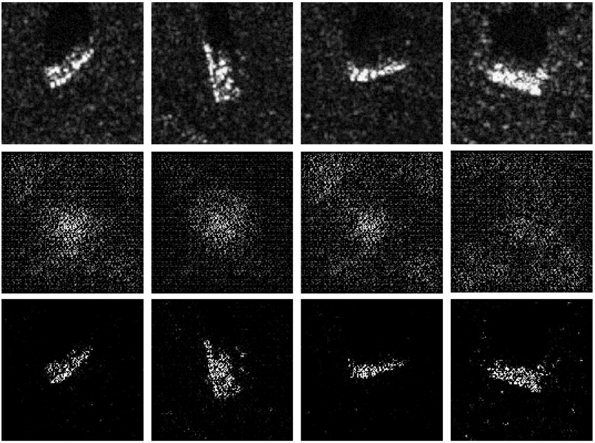

# SGCIF-VAE
The code repository of "**Scattering-guided Class-irrelevant Filtering for Adversarially Robust SAR Automatic Target Recognition**"

Pytorch implementation for **Scattering-guided Class-irrelevant Filtering for Adversarially Robust SAR Automatic Target Recognition**
The code will be released upon acceptance.

