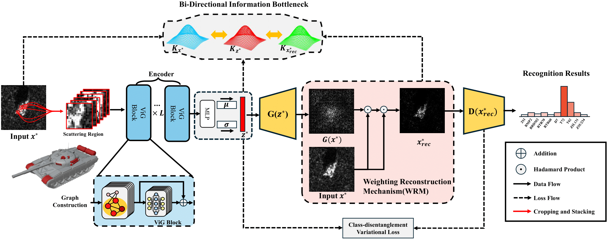

<p align="center">
  <h1 align="center">Scattering-guided class-irrelevant filtering for adversarially robust SAR automatic target recognition (Signal Processing' 2026)</h1>
  <p align="center">
    <strong>Zhunga Liu</strong></a>
    &nbsp;&nbsp;
    <a href="https://github.com/jialinlvcn"><strong>Jialin Lyu</strong></a>&nbsp;&nbsp;
    <a href="https://github.com/fuyimin96"><strong>Yimin Fu*</strong></a>
  </p>
  <br>



Pytorch implementation for "[**Scattering-guided Class-irrelevant Filtering for Adversarially Robust SAR Automatic Target Recognition**](https://www.sciencedirect.com/science/article/pii/S0165168425003871)"

> **Abstract:** *The vulnerability of deep neural networks (DNNs) to adversarial perturbations severely constrains their deployment in real-world applications. A common approach to defend against such perturbations is to perform input reconstruction based on image representations. However, the lack of visual intuitiveness in synthetic aperture radar (SAR) images severely complicates the reconstruction of critical target information, making the adversarial robustness of SAR automatic target recognition (ATR) systems difficult to guarantee. To address this problem, we propose a scattering-guided class-irrelevant filtering variational autoencoder (SGCIF-VAE) for adversarially robust SAR ATR. Specifically, the proposed method incorporates scattering and image-based representations to reconstruct target information from adversarial examples through feature representation and information filtering. First, strong scattering points of the target are exploited to guide the extraction of topological features, which exhibit stronger stability against adversarial perturbations than visual features. Then, a weighting reconstruction mechanism (WRM) is applied to the reconstructed image to supplement the spatial structural information. Consequently, the attention shifts induced by adversarial perturbations are effectively resisted. During training, class-relevant and class-irrelevant information are explicitly separated via a class-disentanglement variational loss (CDVL). Moreover, a bi-directional information bottleneck (BDIB) is employed to amplify the disparity in mutual information of latent variables between the input and reconstructed images, further facilitating the filtering of class-irrelevant information. Extensive experimental results on the MSTAR dataset demonstrate that SGCIF-VAE achieves superior adversarial robustness across various operating conditions. The proposed method achieves over 90% accuracy against weak perturbations and above 60% against stronger ones.*

## Requirements
To install the requirements, you can run the following in your environment first:
```bash
pip install -r requirements.txt
```
To run the code with CUDA properly, you can comment out `torch` and `torchvision` in `requirement.txt`, and install the appropriate version of `torch` and `torchvision` according to the instructions on [PyTorch](https://pytorch.org/get-started/locally/).

Or you can use `uv` to install dependencies:
```bash
uv sync
```
## Datasets

For the dataset used in this paper, please download the following datasets [MSTAR]() / [SAR_ACD]() / [SRSDDv1.0]() and move them to `./sar_datasets`.

## Run The Code
To start training with SGCIF-VAE, run the following command in your terminal:

```bash
python training/train_sgcif.py --data_root ./sar_datasets --task MSTAR_SOC --device cuda:0
```

You can adjust arguments such as `--task`, `--device`, `--epochs`, `--batch_size`, etc. For all available options, see the corresponding script or use:
```bash
python training/train_sgcif.py --help
```

To train other models, use the following commands:

- Standard model:
  ```bash
  python training/train_standard.py --data_root ./sar_datasets --task MSTAR_SOC --device cuda:0
  ```
- PSGAN model:
  ```bash
  python training/train_psgan.py --data_root ./sar_datasets --task MSTAR_SOC --device cuda:0
  ```
- CDVAE model:
  ```bash
  python training/train_cdvae.py --data_root ./sar_datasets --task MSTAR_SOC --device cuda:0
  ```
- APE model:
  ```bash
  python training/train_ape.py --data_root ./sar_datasets --task MSTAR_SOC --device cuda:0
  ```

Each script supports similar arguments. For details, use the `--help` option with the corresponding script.

## Results

The following table summarizes the classification results of different defense methods on the MSTAR dataset with ResNet-18 and VGG-16 backbones. All adversarial samples for training are generated by the PGD method. The best defense performance for each model is highlighted in bold.

### The Results of ResNet-18 backbone 

| Method         | Clean   | PGD 16/255 | PGD 32/255 | BIM 16/255 | BIM 32/255 | C&W_inf 16/255 | C&W_inf 32/255 | Weights |
|---------------|---------|------------|------------|------------|------------|----------------|----------------|---------|
| Standard      | 97.94%  | 0.00%      | 0.00%      | 0.00%      | 0.00%      | 0.00%          | 0.00%          |  |
| JPEG          | **98.64%** | 0.00%   | 0.00%      | 0.00%      | 0.00%      | 0.00%          | 0.00%          |  |
| AT            | 96.91%  | 82.43%     | 31.38%     | 71.38%     | 14.60%     | 81.90%         | 33.15%         |  |
| TR            | 97.20%  | 82.31%     | 35.09%     | 71.88%     | 15.59%     | 81.69%         | 34.93%         |  |
| APE-GAN       | 92.29%  | 84.62%     | 1.48%      | 67.59%     | 0.08%      | 87.71%         | 44.08%         |  |
| PS-GAN        | 97.28%  | 72.54%     | 10.23%     | 55.13%     | 4.04%      | 72.37%         | 12.16%         |  |
| CD-VAE AT     | 97.69%  | 88.49%     | 84.04%     | 87.30%     | 81.36%     | 71.05%         | 8.58%          | |
| CD-VAE TR     | 97.57%  | 85.11%     | 78.80%     | 83.63%     | 77.03%     | 69.81%         | 8.95%          | |
| SGCIF-VAE AT  | 97.24%  | 91.67%     | **84.37%** | **90.97%** | **83.51%** | 90.52%         | 68.37%         | [Weights]() |
| SGCIF-VAE TR  | 96.08%  | **91.71%** | 81.40%     | 90.76%     | 80.74%     | **91.63%**     | **77.20%**     | [Weights]() |

### The Results of Vgg-16 backbone 

| Method         | Clean   | PGD 16/255 | PGD 32/255 | BIM 16/255 | BIM 32/255 | C&W_inf 16/255 | C&W_inf 32/255 | Weights |
|---------------|---------|------------|------------|------------|------------|----------------|----------------|---------|
| Standard      | **98.64%** | 0.00%   | 0.00%      | 0.00%      | 0.00%      | 0.00%          | 0.00%          |  |
| JPEG          | 98.60%  | 0.00%      | 0.00%      | 0.00%      | 0.00%      | 0.00%          | 0.00%          |  |
| AT            | 97.61%  | 86.64%     | 48.78%     | 78.72%     | 31.46%     | 86.19%         | 47.88%         |  |
| TR            | 97.61%  | 87.09%     | 51.38%     | 79.01%     | 30.60%     | 87.13%         | 51.30%         |  |
| APE-GAN       | 92.49%  | 53.77%     | 0.58%      | 26.80%     | 0.04%      | 66.76%         | 23.59%         |  |
| PS-GAN        | 97.24%  | 81.86%     | 38.19%     | 70.89%     | 23.34%     | 81.94%         | 36.78%         |  |
| CD-VAE AT     | 92.78%  | 82.19%     | 79.01%     | 81.65%     | 75.92%     | 51.30%         | 12.82%         |  |
| CD-VAE TR     | 93.40%  | 89.14%     | 83.30%     | 85.81%     | 83.46%     | 68.74%         | 28.41%         |  |
| SGCIF-VAE AT  | 97.32%  | **95.22%** | **92.95%** | **94.80%** | **92.54%** | 90.56%         | 74.39%         | [Weights]() |
| SGCIF-VAE TR  | 97.53%  | 93.81%     | 87.01%     | 92.41%     | 86.31%     | **92.78%**     | **77.61%**     | [Weights]() |

## Citation
If you find our work and this repository useful. Please consider giving a star :star: and citation.
```bibtex
@article{liu2026scattering,
    title = {Scattering-guided class-irrelevant filtering for adversarially robust SAR automatic target recognition},
    author = {Zhunga Liu and Jialin Lyu and Yimin Fu},
    journal = {Signal Processing},
    volume = {239},
    pages = {110273},
    year = {2026},
    issn = {0165-1684},
}
```